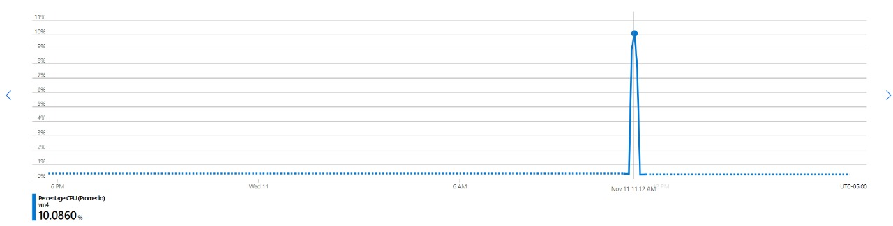

### Escuela Colombiana de Ingeniería
### Arquitecturas de Software - ARSW

## Escalamiento en Azure con Maquinas Virtuales, Sacale Sets y Service Plans

### Dependencias
* Cree una cuenta gratuita dentro de Azure. Para hacerlo puede guiarse de esta [documentación](https://azure.microsoft.com/en-us/free/search/?&ef_id=Cj0KCQiA2ITuBRDkARIsAMK9Q7MuvuTqIfK15LWfaM7bLL_QsBbC5XhJJezUbcfx-qAnfPjH568chTMaAkAsEALw_wcB:G:s&OCID=AID2000068_SEM_alOkB9ZE&MarinID=alOkB9ZE_368060503322_%2Bazure_b_c__79187603991_kwd-23159435208&lnkd=Google_Azure_Brand&dclid=CjgKEAiA2ITuBRDchty8lqPlzS4SJAC3x4k1mAxU7XNhWdOSESfffUnMNjLWcAIuikQnj3C4U8xRG_D_BwE). Al hacerlo usted contará con $200 USD para gastar durante 1 mes.

### Parte 0 - Entendiendo el escenario de calidad

Adjunto a este laboratorio usted podrá encontrar una aplicación totalmente desarrollada que tiene como objetivo calcular el enésimo valor de la secuencia de Fibonnaci.

**Escalabilidad**
Cuando un conjunto de usuarios consulta un enésimo número (superior a 1000000) de la secuencia de Fibonacci de forma concurrente y el sistema se encuentra bajo condiciones normales de operación, todas las peticiones deben ser respondidas y el consumo de CPU del sistema no puede superar el 70%.

### Parte 1 - Escalabilidad vertical

1. Diríjase a el [Portal de Azure](https://portal.azure.com/) y a continuación cree una maquina virtual con las características básicas descritas en la imágen 1 y que corresponden a las siguientes:
    * Resource Group = SCALABILITY_LAB
    * Virtual machine name = VERTICAL-SCALABILITY
    * Image = Ubuntu Server 
    * Size = Standard B1ls
    * Username = scalability_lab
    * SSH publi key = Su llave ssh publica


2. Para conectarse a la VM use el siguiente comando, donde las `x` las debe remplazar por la IP de su propia VM.

    `ssh scalability_lab@xxx.xxx.xxx.xxx`

3. Instale node, para ello siga la sección *Installing Node.js and npm using NVM* que encontrará en este [enlace](https://linuxize.com/post/how-to-install-node-js-on-ubuntu-18.04/).
4. Para instalar la aplicación adjunta al Laboratorio, suba la carpeta `FibonacciApp` a un repositorio al cual tenga acceso y ejecute estos comandos dentro de la VM:

    `git clone <your_repo>`

    `cd <your_repo>/FibonacciApp`

    `npm install`

5. Para ejecutar la aplicación puede usar el comando `npm FibinacciApp.js`, sin embargo una vez pierda la conexión ssh la aplicación dejará de funcionar. Para evitar ese compartamiento usaremos *forever*. Ejecute los siguientes comando dentro de la VM.

    `npm install forever -g`

    `forever start FibinacciApp.js`

6. Antes de verificar si el endpoint funciona, en Azure vaya a la sección de *Networking* y cree una *Inbound port rule* tal como se muestra en la imágen. Para verificar que la aplicación funciona, use un browser y user el endpoint `http://xxx.xxx.xxx.xxx:3000/fibonacci/6`. La respuesta debe ser `The answer is 8`.


7. La función que calcula en enésimo número de la secuencia de Fibonacci está muy mal construido y consume bastante CPU para obtener la respuesta. Usando la consola del Browser documente los tiempos de respuesta para dicho endpoint usando los siguintes valores:
    * 1000000
    * 1010000
    * 1020000
    * 1030000
    * 1040000
    * 1050000
    * 1060000
    * 1070000
    * 1080000
    * 1090000    

8. Dírijase ahora a Azure y verifique el consumo de CPU para la VM. (Los resultados pueden tardar 5 minutos en aparecer).


9. Ahora usaremos Postman para simular una carga concurrente a nuestro sistema. Siga estos pasos.
    * Instale newman con el comando `npm install newman -g`. Para conocer más de Newman consulte el siguiente [enlace](https://learning.getpostman.com/docs/postman/collection-runs/command-line-integration-with-newman/).
    * Diríjase hasta la ruta `FibonacciApp/postman` en una maquina diferente a la VM.
    * Para el archivo `[ARSW_LOAD-BALANCING_AZURE].postman_environment.json` cambie el valor del parámetro `VM1` para que coincida con la IP de su VM.
    * Ejecute el siguiente comando.

    ```
    newman run ARSW_LOAD-BALANCING_AZURE.postman_collection.json -e [ARSW_LOAD-BALANCING_AZURE].postman_environment.json -n 10 &
    newman run ARSW_LOAD-BALANCING_AZURE.postman_collection.json -e [ARSW_LOAD-BALANCING_AZURE].postman_environment.json -n 10
    ```

10. La cantidad de CPU consumida es bastante grande y un conjunto considerable de peticiones concurrentes pueden hacer fallar nuestro servicio. Para solucionarlo usaremos una estrategia de Escalamiento Vertical. En Azure diríjase a la sección *size* y a continuación seleccione el tamaño `B2ms`.


11. Una vez el cambio se vea reflejado, repita el paso 7, 8 y 9.
12. Evalue el escenario de calidad asociado al requerimiento no funcional de escalabilidad y concluya si usando este modelo de escalabilidad logramos cumplirlo.
13. Vuelva a dejar la VM en el tamaño inicial para evitar cobros adicionales.

**Preguntas**

1. ¿Cuántos y cuáles recursos crea Azure junto con la VM?

Crea 8 recursos:


	
2. ¿Brevemente describa para qué sirve cada recurso?

	La maquina virtual es el recurso que ofrece Azure para alojar la aplicación sin tener una hardware fisico.

	La llave ssh junto con el grupo de seguridad son los encargados de mantener y gestionar la  seguridad de la maquina virtual a traves de reglas de seguridad que permiten o deniegan el tráfico de red entrante o el tráfico de red saliente de varios tipos de recursos de Azure

	Network Watcher está diseñado para monitorear y reparar el estado de la red de los productos IaaS (infraestructura como servicio) que incluye máquinas virtuales, redes virtuales, puertas de enlace de aplicaciones, balanceadores de carga, etc.

	VNet permite que muchos tipos de recursos de Azure, como Azure Virtual Machines (VM), se comuniquen de forma segura entre sí, con Internet y con las redes locales.

	La direccion ip publica nos permite cominicarnos remotamente con la maquina virtual.

	El disco nos permite tener almacenamiento en la maquina virtual.

	Una interfaz de red permite que una VM de Azure se comunique con Internet, Azure y recursos locales.
	
3. ¿Al cerrar la conexión ssh con la VM, por qué se cae la aplicación que ejecutamos con el comando `npm FibonacciApp.js`? ¿Por qué debemos crear un *Inbound port rule* antes de acceder al servicio?
	
	Al cerrar la conexión tambien terminamos el proceso del "FibonacciApp.js" y al ser este el proceso que inicia la aplicaciones esta se cae.
	
	Debemos crear un *Inbound port rule* para permitir que el acceso al servicio al publico.
	
4. Adjunte tabla de tiempos e interprete por qué la función tarda tando tiempo.

	
	
	
	
5. Adjunte imágen del consumo de CPU de la VM e interprete por qué la función consume esa cantidad de CPU.

	
	
	Antes del escalamiento vertical el consumo de cpu llega a 100% ya que esta presenta una capacidad reducida, al realizar el escalamiento vertical aumentamos la capacidad de la cpu por lo que
	el consumo llega solamente al 45%.
	
6. Adjunte la imagen del resumen de la ejecución de Postman. Interprete:
    * Tiempos de ejecución de cada petición.
	
	Antes de escalar
	
	
	
	Despues de escalar
	
	
	
	Podemos ver una mejora considerable en el tiempo de respuesta.
	
    * Si hubo fallos documentelos y explique.
	
		Antes de escalar fallan algunas peticiones por el alto consumo que presenta la cpu, despues de escalar se presentan algunos fallos aparentemente por la alta concurrencia
	
7. ¿Cuál es la diferencia entre los tamaños `B2ms` y `B1ls` (no solo busque especificaciones de infraestructura)?

	El tamaño de VM de la serie B, B1ls, tiene la memoria más pequeña y el costo más bajo entre las instancias de Azure. B1ls tiene 512 MiB de memoria y 1 vCPU.
	B1ls es mejor para servidores web pequeños, bases de datos pequeñas y entornos de desarrollo y prueba. Ofrece una forma rentable de implementar cargas de trabajo que no necesitan el rendimiento completo de la CPU de forma continua y aumentan su rendimiento.
	
	El tamaño de VM de la serie B, B2ms, B2ms tiene 8 GiB de memoria y 2 vCPU.
	
8. ¿Aumentar el tamaño de la VM es una buena solución en este escenario?, ¿Qué pasa con la FibonacciApp cuando cambiamos el tamaño de la VM?
	
	En un escenario inicial si seria una buena solución al mejorar la capacidad de procesamiento. Cuando cambiamos el tamaño de la vm los tiempos de respuesta mejoran al igual que la carga a la cpu.

9. ¿Qué pasa con la infraestructura cuando cambia el tamaño de la VM? ¿Qué efectos negativos implica?
	
	El costo de dicha infraestructura aumenta por lo que es mas cara de mantener.
	
10. ¿Hubo mejora en el consumo de CPU o en los tiempos de respuesta? Si/No ¿Por qué?

	Hubo mejora en ambos aspectos ya que con el nuevo tamaña la maquina virtual tiene una mejor cpu con mas capacidad.

11. Aumente la cantidad de ejecuciones paralelas del comando de postman a `4`. ¿El comportamiento del sistema es porcentualmente mejor?

	El comportamiento si es porcentualmente mejor ya que presenta menos fallos.

### Parte 2 - Escalabilidad horizontal

#### Crear el Balanceador de Carga

Antes de continuar puede eliminar el grupo de recursos anterior para evitar gastos adicionales y realizar la actividad en un grupo de recursos totalmente limpio.

1. El Balanceador de Carga es un recurso fundamental para habilitar la escalabilidad horizontal de nuestro sistema, por eso en este paso cree un balanceador de carga dentro de Azure tal cual como se muestra en la imágen adjunta.


2. A continuación cree un *Backend Pool*, guiese con la siguiente imágen.


3. A continuación cree un *Health Probe*, guiese con la siguiente imágen.


4. A continuación cree un *Load Balancing Rule*, guiese con la siguiente imágen.


5. Cree una *Virtual Network* dentro del grupo de recursos, guiese con la siguiente imágen.


#### Crear las maquinas virtuales (Nodos)

Ahora vamos a crear 3 VMs (VM1, VM2 y VM3) con direcciones IP públicas standar en 3 diferentes zonas de disponibilidad. Después las agregaremos al balanceador de carga.

1. En la configuración básica de la VM guíese por la siguiente imágen. Es importante que se fije en la "Avaiability Zone", donde la VM1 será 1, la VM2 será 2 y la VM3 será 3.


2. En la configuración de networking, verifique que se ha seleccionado la *Virtual Network*  y la *Subnet* creadas anteriormente. Adicionalmente asigne una IP pública y no olvide habilitar la redundancia de zona.


3. Para el Network Security Group seleccione "avanzado" y realice la siguiente configuración. No olvide crear un *Inbound Rule*, en el cual habilite el tráfico por el puerto 3000. Cuando cree la VM2 y la VM3, no necesita volver a crear el *Network Security Group*, sino que puede seleccionar el anteriormente creado.


4. Ahora asignaremos esta VM a nuestro balanceador de carga, para ello siga la configuración de la siguiente imágen.


5. Finalmente debemos instalar la aplicación de Fibonacci en la VM. para ello puede ejecutar el conjunto de los siguientes comandos, cambiando el nombre de la VM por el correcto

```
git clone https://github.com/daprieto1/ARSW_LOAD-BALANCING_AZURE.git

curl -o- https://raw.githubusercontent.com/creationix/nvm/v0.34.0/install.sh | bash
source /home/vm1/.bashrc
nvm install node

cd ARSW_LOAD-BALANCING_AZURE/FibonacciApp
npm install

npm install forever -g
forever start FibonacciApp.js
```

Realice este proceso para las 3 VMs, por ahora lo haremos a mano una por una, sin embargo es importante que usted sepa que existen herramientas para aumatizar este proceso, entre ellas encontramos Azure Resource Manager, OsDisk Images, Terraform con Vagrant y Paker, Puppet, Ansible entre otras.

#### Probar el resultado final de nuestra infraestructura

1. Porsupuesto el endpoint de acceso a nuestro sistema será la IP pública del balanceador de carga, primero verifiquemos que los servicios básicos están funcionando, consuma los siguientes recursos:

```
http://52.155.223.248/
http://52.155.223.248/fibonacci/1
```

2. Realice las pruebas de carga con `newman` que se realizaron en la parte 1 y haga un informe comparativo donde contraste: tiempos de respuesta, cantidad de peticiones respondidas con éxito, costos de las 2 infraestrucruras, es decir, la que desarrollamos con balanceo de carga horizontal y la que se hizo con una maquina virtual escalada.

3. Agregue una 4 maquina virtual y realice las pruebas de newman, pero esta vez no lance 2 peticiones en paralelo, sino que incrementelo a 4. Haga un informe donde presente el comportamiento de la CPU de las 4 VM y explique porque la tasa de éxito de las peticiones aumento con este estilo de escalabilidad.

```
newman run ARSW_LOAD-BALANCING_AZURE.postman_collection.json -e [ARSW_LOAD-BALANCING_AZURE].postman_environment.json -n 10 &
newman run ARSW_LOAD-BALANCING_AZURE.postman_collection.json -e [ARSW_LOAD-BALANCING_AZURE].postman_environment.json -n 10 &
newman run ARSW_LOAD-BALANCING_AZURE.postman_collection.json -e [ARSW_LOAD-BALANCING_AZURE].postman_environment.json -n 10 &
newman run ARSW_LOAD-BALANCING_AZURE.postman_collection.json -e [ARSW_LOAD-BALANCING_AZURE].postman_environment.json -n 10
```

**Preguntas**

* ¿Cuáles son los tipos de balanceadores de carga en Azure y en qué se diferencian?, ¿Qué es SKU, qué tipos hay y en qué se diferencian?, ¿Por qué el balanceador de carga necesita una IP pública?

	**Load Balancers**

	Existen dos tipos de Balanceadores de carga Un balanceador de carga público puede proporcionar conexiones salientes para máquinas virtuales (VM) dentro de su red virtual. Estas conexiones se logran traduciendo sus direcciones IP privadas a direcciones IP públicas. Los balanceadores de carga públicos se utilizan para equilibrar la carga del tráfico de Internet hacia sus máquinas virtuales.

	Se utiliza un equilibrador de carga interno (o privado) cuando se necesitan direcciones IP privadas solo en la interfaz. Los equilibradores de carga internos se utilizan para equilibrar la carga del tráfico dentro de una red virtual. Se puede acceder a una interfaz de balanceador de carga desde una red local en un escenario híbrido. 
	
	**SKU**

	Azure Container Registry está disponible en varios niveles de servicio (también conocidos como SKU). SKU Significa Unidad de mantenimiento de existencias (Stock Keeping Unit), son un código único asignado a un servicio o producto dentro de azure y representan la posibilidad para comprar existestencias.

	Estos niveles proporcionan precios predecibles y varias opciones para alinearse con la capacidad y los patrones de uso de su registro Docker privado en Azure.

	Básico : Un punto de entrada con costos optimizados para que los desarrolladores aprendan sobre Azure Container Registry. Los registros básicos tienen las mismas capacidades programáticas que Standard y Premium.
	
	Estándar : Los registros estándar ofrecen las mismas capacidades que los básicos, con un mayor rendimiento de imágenes y almacenamiento incluido. Los registros estándar deben satisfacer las necesidades de la mayoría de los escenarios de producción.
	
	Premium : Los registros Premium proporcionan la mayor cantidad de almacenamiento incluido y operaciones simultáneas, lo que permite escenarios de gran volumen. Además de un mayor rendimiento de imágenes, Premium agrega características como la replicación geográfica para administrar un solo registro en múltiples regiones, confianza en el contenido para la firma de etiquetas de imagen, enlace privado con puntos finales privados para restringir el acceso al registro

	**IP pública en los balanceadores de carga**

	Es necesario asociar una dirección IP pública con una instancia de Azure Load Balancer para que pueda ser accesible desde internet. Esta dirección IP pública actúa como dirección IP de carga equilibrada.

* ¿Cuál es el propósito del *Backend Pool*?
	
	Define el grupo de recursos que brindarán tráfico para una regla de equilibrio de carga determinada.

* ¿Cuál es el propósito del *Health Probe*?
	
	Determina si la instancia está en buen estado. Si la instancia falla su prueba de estado suficientes veces, dejará de recibir tráfico hasta que comience a pasar las 
	pruebas de estado nuevamente.

* ¿Cuál es el propósito de la *Load Balancing Rule*? ¿Qué tipos de sesión persistente existen, por qué esto es importante y cómo puede afectar la escalabilidad del sistema?.


	**Distribución basada en hash**
	El modo de distribución predeterminado para Azure Load Balancer es un hash de tupla de cinco
	elementos.
	La tupla consta de:
		
	* IP de origen
		
	* Puerto de origen
		
	* IP de destino
		
	* Puerto de destino
		
	* Tipo de protocolo
	
	El hash se utiliza para asignar el tráfico a los servidores disponibles. El algoritmo solo proporciona
	adherencia dentro de una sesión de transporte. Los paquetes que se encuentran en la misma
	sesión se dirigen a la misma dirección IP del centro de datos tras el punto de conexión con
	equilibrio de carga. Cuando el cliente inicia una nueva sesión desde la misma IP de origen, el
	puerto de origen cambia y provoca que el tráfico vaya hacia otro punto de conexión del centro de
	datos.
	
	**Modo de afinidad de IP de origen**
	El modo utiliza un hash de tupla de dos elementos (IP de origen e IP de destino) o de tres
elementos (IP de origen, IP de destino y tipo de protocolo) para asignar el tráfico a los servidores
disponibles. Mediante el uso de la afinidad de la IP de origen, las conexiones que se han iniciado
desde el mismo equipo cliente van al mismo punto de conexión del centro de datos.

* ¿Qué es una *Virtual Network*? ¿Qué es una *Subnet*? ¿Para qué sirven los *address space* y *address range*?

	Azure Virtual Network (VNet) es el bloque de construcción fundamental para su red privada en Azure. VNet permite que muchos tipos de recursos de Azure, como Azure Virtual Machines (VM), se comuniquen de forma segura entre sí, con Internet y con las redes locales.
	
	las subredes permiten segmentar la red virtual en una o más subredes y asignar una parte del espacio de direcciones de la red virtual a cada subred.
	
	Al crear una red virtual, se debe especificar un espacio de direcciones IP privado personalizado utilizando direcciones públicas y privadas (RFC 1918). Azure asigna a los recursos de una red virtual una dirección IP privada desde el espacio de direcciones.
	
	

* ¿Qué son las Availability Zone y por qué seleccionamos 3 diferentes zonas?. ¿Qué significa que una IP sea zone-redundant?

	Las zonas de disponibilidad son ubicaciones aisladas de errores en una región de Azure que
	proporcionan alimentación, refrigeración y funcionalidad de red redundantes. Estas zonas
	permiten ejecutar aplicaciones críticas con alta disponibilidad y tolerancia a errores en los
	centros de datos.
	
	Seleccionamos 3 zonas de disponibilidad diferentes para tener la capacidad de aislar las
	máquinas virtuales dentro de tres centros de datos diferentes. Esto proporciona zonas de
	disponibilidad múltiples y previene una caída total del sistema en caso de algún fallo en
	alguna zona de disponibilidad.

* ¿Cuál es el propósito del *Network Security Group*?
	
	Un Network Security Group consta de un conjunto de reglas de control de acceso que describen los
	filtros de tráfico. Estos pueden asociarse con una máquina virtual o una subred en la misma región.
	Las reglas definidas en el grupo de seguridad de red actúan como filtros. En la ruta de ingreso, se
	aplican antes de que el tráfico ingrese a la VM.

* Informe de newman 1 (Punto 2)


### Pruebas con Escalabilidad Vertical


Cada solicitud se demoro en promedio 27.2 segundos donde 4 solicitudes fallaron.

#### Costo de la infraestructura

   | Recurso | Descripción | Costo |
   |------|-----|-----------------|
   | Virtual Machines | 1 B2MS; Linux – Ubuntu, 0 managed OS disks – S4, 100 transaction units, 5 GB Bandwidth | $60.79 |
   | Virtual Network | 100 GB data transfer from East US region to East US region | $2.00 |
   | IP Addresses | 0 Dynamic IP Addresses, 1 Static IP Addresses | $2.63 |
   | Storage Accounts | Managed Disks, Standard HDD, S4 Disk Type 1 Disks | $1.59 |
   | Total |            | $67.01 |


### Pruebas con Escalabilidad Horizontal


Cada solicitud se demoro en promedio 27.6 segundos donde ninguna solicitud falló.

#### Costo de la infraestructura

   | Recurso | Descripción | Costo |
   |------|-----|-----------------|
   | Virtual Machines | 3 B1LS, Linux – Ubuntu, 0 managed OS disks – S4, 100 transaction units; 5 GB Bandwidth | $12.48 |
   | Virtual Network | 100 GB data transfer from East US region to East US region | $2.00 |
   | IP Addresses | 4 Dynamic IP Addresses, 1 Static IP Addresses | $11.39 |
   | Storage Accounts | Managed Disks, Standard HDD, S4 Disk Type 1 Disks | $1.59 |
   | Total |            | $27.46 |

   

### Uso cpu


VM1 consumo de CPU promedio de 60.47%


VM2 consumo de CPU promedio de 48.10%


VM3 consumo de CPU promedio de 31.8%



VM4 consumo de CPU promedio de 10.08%

### Conclusiones

   * Entre los dos enfoques de escalabilidad no hubo mucha diferencia respecto a los tiempos de ejecución, en la infraestructura con escalabilidad vertical se presentaron varios casos fallidos, mientras que con escalabilidad horizontal no se presentaron fallos.
   
   * Una solución con escalabilidad vertical cuesta más del doble que una con escalabilidad horizontal y en caso de realizar otro escalamiento vertical esta diferencia se ve aumentada.
      
   * En cuanto a este laboratorio es mejor realizar una implementación con escalabilidad horizontal que una con escalabilidad vertical ya que al poseer varios nodos y un balanceador de carga se reduce la probabilidad de que ocurran errores cuando se presentan varias solicitudes concurrentes.


* Presente el Diagrama de Despliegue de la solución.


